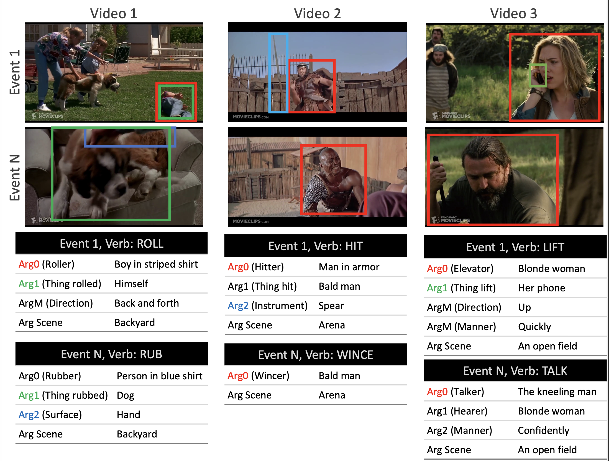

# Grounded Video Situation Recognition (NeurIPS 2022)

[](https://github.com/zeeshank95/GVSR/blob/master/LICENSE)
[](https://www.python.org/)

[](https://arxiv.org/abs/2210.10828)

**[Grounded Video Situation Recognition](https://arxiv.org/abs/2104.00990)**<br>
[Zeeshan Khan](https://zeeshank95.github.io), [C V Jawahar](https://faculty.iiit.ac.in/~jawahar/), [Makarand Tapaswi](https://makarandtapaswi.github.io)

GVSR is a structured dense video understanding task. It is built on top of [VidSitu](https://arxiv.org/abs/2104.00990). A large scale dataset containing videos of 10 seconds from complex movie scenes. Dense video understanding requires answering several questions such as who is doing what to whom, with what, how, and where. GVSR affords this by recognising the action verbs, their corresponding roles, and localising them in the spatio-temporal domain in a weakly supervised setting, i.e. the supervision for grounding is provided only in form of role-captions without any ground truth bounding boxes.



This repository includes:

1. Instructions to download the precomputed object and video features of the VidSitu Dataset. 
2. Instructions for Installing the GVSR dependencies.
3. Code for both the frameworks of GVSR. (i) With ground truth roles and (ii) End-to-end GVSR.

# Download

Please see [DATA_PREP.md](./data/DATA_PREP.md) for the instructions on downloading and setting up the dataset and the pre-extracted object and video features. 

Note: Running the code does not require the raw videos. If you wish to download the videos please refer to (https://github.com/TheShadow29/VidSitu/blob/main/data/DATA_PREP.md)


# Installation

Please see [INSTALL.md](./INSTALL.md) for setting up the conda environment and installing the dependencies


# Training

- Basic usage is `CUDA_VISIBLE_DEVICES=$GPUS python main_dist.py "experiment_name" --arg1=val1 --arg2=val2` and the arg1, arg2 can be found in `configs/vsitu_cfg.yml`.

- YML has a hierarchical structure which is supported using `.`
    For instance, if you want to change the `num_encoder_layers` under `transformer_VO_RO` which in the YML file looks like
    ```
    transformer_VO_RO:
        num_encoder_layers: 3
    ```
    you can pass `--transformer_VO_RO.num_encoder_layers=5`

- Sometimes it might be easier to directly change the default setting in `configs/vsitu_cfg.yml` itself.

## Framework 1: Using Ground Truth Roles 

Use the option `grounded_vb_srl_GT_role` for the `--task_type` argument, this means predicting verbs and semantic role captions provided the ground truth roles.

After each epoch, evalutation is performned for the 3 tasks: 1) Verb prediction 2) SRL(caption generation) and 3) Grounded SRL. 

- Run `CUDA_VISIBLE_DEVICES=0 python main_dist.py experiment1 --task_type=grounded_vb_srl_GT_role  --train.bs=16 --train.bsv=16`

## Framework 2: End-to-end Situation Recognition

Use the option `grounded_end-to-end` for the `--task_type` argument, this means predicting verbs, roles and, semantic role captions, wihtout using any intermediate ground truth data. This framework allows for end-to-end situation recognition.

- Run `CUDA_VISIBLE_DEVICES=0 python main_dist.py experiment1 --task_type=grounded_end-to-end  --train.bs=16 --train.bsv=16`

After each epoch, evalutation is performned for the 3 tasks: 1)Verb prediction 2) SRL(caption generation) and 3) Grounded SRL.

Note:Evalutation for grounded SRL is coming soon!

# Logging

Logs are stored inside `tmp/` directory. When you run the code with $exp_name the following are stored:
- `txt_logs/$exp_name.txt`: the config used and the training, validation losses after ever epoch.
- `models/$exp_name.pth`: the model, optimizer, scheduler, accuracy, number of epochs and iterations completed are stored. Only the best model upto the current epoch is stored.
- `ext_logs/$exp_name.txt`: this uses the `logging` module of python to store the `logger.debug` outputs printed. Mainly used for debugging.
- `predictions`: the validation outputs of current best model.

Storing grounding results requires extra space and time during evaluation. To enable it use the argument `--train.visualise_bboxes`

Logs are also stored using [MLFlow](https://www.mlflow.org/docs/latest/tracking.html). These can be uploaded to other experiment trackers such as [neptune.ai](https://neptune.ai/), [wandb](https://wandb.ai/site) for better visualization of results.


# Pretrained Model (Framework 1)
Download the pretrained model from here: [Pretrained Model](https://iiitaphyd-my.sharepoint.com/:f:/g/personal/zeeshan_khan_research_iiit_ac_in/EgQ2dJbwo5lBqZcFa8tL9N0Br6UL_ecgYmskGzjJ47r2pA?e=Inga0L)

place it in `model_weights/`

To evaluate the pretrained model, Run- `CUDA_VISIBLE_DEVICES=0 python main_dist.py experiment1 --task_type=grounded_vb_srl_GT_role --only_val --train.resume --train.resume_path=model_weights/mdl_ep_11.pth --train.bs=16 --train.bsv=16`

# Prediction Format 

1. The output format for the files are as follows:

    1. Verb Prediction: 
        ```
        List[Dict]
        Dict:
            # Both lists of length 5. Outer list denotes Events 1-5, inner list denotes Top-5 VerbID predictions
            pred_vbs_ev: List[List[str]]
            # Both lists of length 5. Outer list denotes Events 1-5, inner list denotes the scores for the Top-5 VerbID predictions
            pred_scores_ev: List[List[float]]
            #the index of the video segment used. Corresponds to the number in {valid|test}_split_file.json
            ann_idx: int
        ```

    2. Semantic Role Labeling Prediction:
        ```
        List[Dict]
        Dict:
            # same as above
            ann_idx: int
            # The main output used for evaluation. Outer Dict is for Events 1-5.
            vb_output: Dict[Dict]
            # The inner dict has the following keys:
                # VerbID of the event
                vb_id: str
                ArgX: str
                ArgY: str
                ...
        ```
        Note that ArgX, ArgY depend on the specific VerbID

    3. Grounded SRL:
        ```
        Folder_videoID
            frame 1: [box1, box2, ..] (for event 1 role 1)
            frame 2: [box1, box2, ..] (for event 1 role 2)
            .
            .
            frame t: [box1, box2, ..] (for event n role m)
        ```

# Citation
```
@inproceedings{khan2022grounded,
        title={Grounded Video Situation Recognition},
        author={Zeeshan Khan and C.V. Jawahar and Makarand Tapaswi},
        booktitle={Advances in Neural Information Processing Systems},
        year={2022},
        url={https://openreview.net/forum?id=yRhbHp_Vh8e}
}

@InProceedings{Sadhu_2021_CVPR,
        author = {Sadhu, Arka and Gupta, Tanmay and Yatskar, Mark and Nevatia, Ram and Kembhavi, Aniruddha},
        title = {Visual Semantic Role Labeling for Video Understanding},
        booktitle = {The IEEE Conference on Computer Vision and Pattern Recognition (CVPR)},
        month = {June},
        year = {2021}
}
```
